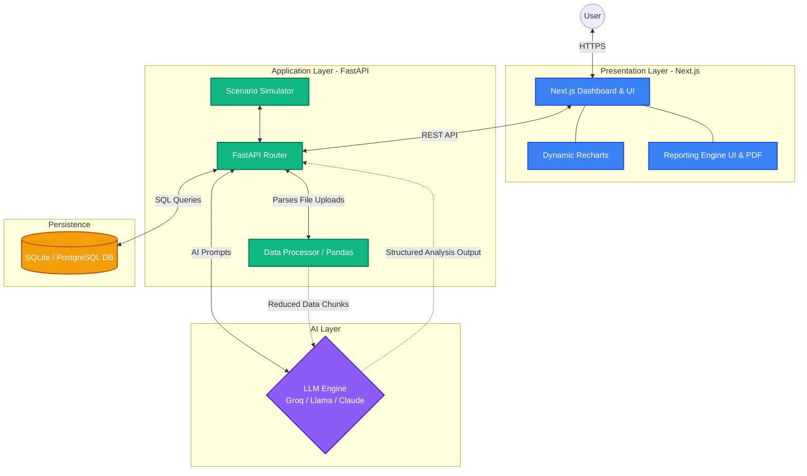

# Thadata Analytics

**Thadata Analytics** is an autonomous AI data analyst and decision intelligence engine. It acts as your Senior Data Analyst, Data Scientist, and Business Intelligence consultant wrapped into a responsive web platform. Thadata empowers businesses to upload their datasets, run complex analyses seamlessly, receive strategic reports, and visualize their data through an intuitive UI without writing any query code.

---

## 🏛️ Architecture

Thadata Analytics is organized into a clean **Client-Server-LLM** architecture to enforce a separation of concerns and maintain security over API integrations.



### Component Breakdown
1. **Frontend**: A React-based Single Page Application (SPA) utilizing `Next.js` and `TailwindCSS` for modern aesthetics. It provides interactive charts (`recharts`) and integrates robustly with `@supabase/auth-js` for authentication.
2. **Backend**: A robust, asynchronous `FastAPI` server powered by Python. It utilizes SQLAlchemy for underlying data structures (Team, Integrations, Alerts) and features a heavy processing sequence built around Pandas for data scrubbing.
3. **Intelligence Layer**: The backend formats your user data into strict system-prompted packets and securely submits them to an external LLM using precise API contracts, mapping the AI's deductions directly into robust UI dashboards.

---

## 📋 Product Requirements Document (PRD)

### 1. Product Vision
To democratize advanced data science and business intelligence by constructing a fully automated, AI-driven data analyst capable of extracting growth opportunities, mitigating risks, and generating executive reports without technical overhead.

### 2. Core Objectives
- **Maximize Revenue & Efficiency:** Always provide actionable insights and quantify business impact.
- **Minimize Barrier to Entry:** Drag-and-drop data capabilities (CSV, Database integrations) with zero prior SQL knowledge required.
- **Provide Definitive Confidence:** Deliver outputs with confidence scores generated by strict statistical validation from the LLM core.

### 3. Key Use Cases
- Business Intelligence Directors auditing automated monthly performance trends.
- Startups running instant scenario modeling ("What is the predicted churn rate if the base price goes up 10%?").
- Analysts offloading tedious dataset parsing and SQL scaffolding so they can focus on high-impact interpretation.

### 4. Features & Requirements

**A. Data Ingestion & Integrity**
- Users must be able to upload tabular data (.csv, .xlsx) directly into the platform.
- Integration support extending into direct Data Source connectivity (PostgreSQL, Google Analytics 4 mapping).
- Backend must detect anomalies, missing values, and data gaps before allowing the LLM to process to avoid hallucinations.

**B. Analytics Dashboard**
- Render automated KPI summary cards derived strictly from ingested datasets.
- Construct live, responsive interactive charts (Line, Bar, Doughnut) interpreting the latest analysis request.

**C. AI Chat & Queries**
- The system must function conversationally—users can ask plain-english questions (e.g. *"Show me the breakdown of quarterly churn"*).
- The AI responds specifically with structured data schemas enabling visual UI rendering rather than large raw markdown strings.

**D. Strategic Reporting Generation**
- Single-click compilation of comprehensive "Executive Summary" reports.
- Reports must package *Introduction, Findings, Confirmed Methodologies, and Recommended Actions* cleanly.
- Export layout options directly to standard **A4 PDF layout** and **DOCX formulation**.

**E. Team & Workspace Management**
- Secure multi-tier organizational mapping (`Owner`, `Admin`, `Analyst`, `Viewer`).
- Automated notification logic governing active data warning *Alerts*.

### 5. Non-Functional Requirements
- **Performance:** Complex datasets must be subset/chunked effectively in the backend so LLM queries do not invoke external API timeouts heavily exceeding > 30s parameters.
- **Design:** Modern dark-mode premium UX, utilizing tight typographies and seamless macro-animations.
- **Security:** Strict tracking of API keys through environment variables. Data must be sanitized before reaching the conversational LLM proxy.

---

## 🚀 Quick Setup & Deployment

### Local Development
1. Clone the repository and split into two terminals.
2. **Backend:**
    ```bash
    cd backend
    python3 -m venv .venv
    source .venv/bin/activate
    pip install -r requirements.txt
    uvicorn main:app --reload
    ```
3. **Frontend:**
    ```bash
    cd frontend
    npm install
    npm run dev
    ```

### Production Deployment
*Please strictly refer to the split-deployment strategy!*
- Hook the `/frontend` directly up to **Vercel** with the Root Directory mapped over.
- Use the included `/backend/render.yaml` footprint to host your FastAPI engine asynchronously on a robust serverless persistent host like **Render**, supplying it with your active API Keys.

---

## 👥 Contributors

- [@bellonbits](https://github.com/bellonbits)

